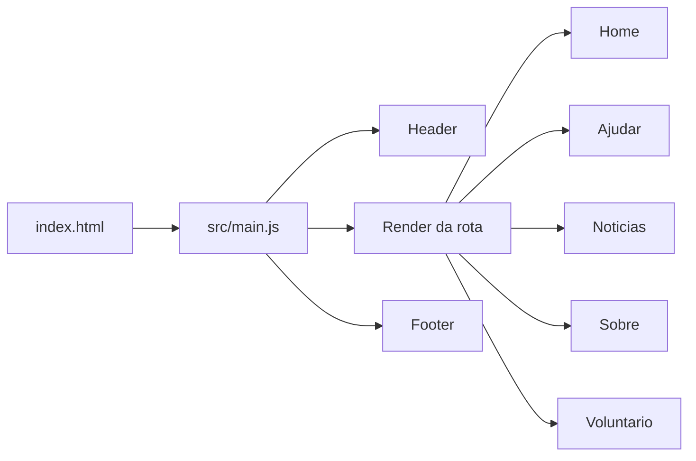
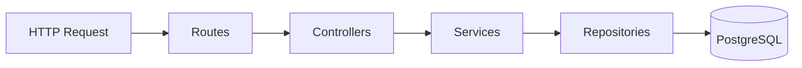

# Arquitetura do Sistema Pelu&Cia

## Visão geral

O Pelu&Cia é um sistema web dividido em duas camadas principais:

- `frontend`: SPA em Vite com JavaScript vanilla, roteamento no cliente e consumo de API por `fetch`.
- `backend`: API Node.js + Express com PostgreSQL, organizada em camadas de rota, controller, service e repository.

O sistema centraliza comunicação institucional do projeto social, notícias, contato, voluntariado e prestação de contas.

## Stack

### Frontend

- Vite
- JavaScript ES Modules
- HTML único em `index.html`
- CSS por domínio/página
- Roteamento manual com `history.pushState`

### Backend

- Node.js
- Express 5
- `pg`
- `dotenv`
- `cors`

### Infra local

- PostgreSQL 16 em Docker

## Estrutura

```txt
Pelu-Cia/
├── backend/
│   ├── app.js
│   ├── index.js
│   ├── config/
│   ├── controllers/
│   ├── database/
│   ├── middlewares/
│   ├── repositories/
│   ├── routes/
│   ├── services/
│   └── utils/
├── public/
├── src/
│   ├── css/
│   └── js/
├── docs/
├── index.html
├── package.json
└── docker-compose.yml
```

## Frontend

O frontend é uma SPA simples. `src/main.js` carrega a rota atual, monta cabeçalho e rodapé e executa o `afterRender` da página.

### Rotas

- `/` e `/index.html`: home
- `/ajudar`: doações e prestação de contas pública
- `/noticias`: notícias
- `/sobre`: apresentação institucional
- `/voluntario`: inscrição de voluntário

### Fluxo do cliente



### Páginas dinâmicas

- `home.js`: mostra notícias demonstrativas e registra mensagem simulada no navegador.
- `noticias.js`: mostra notícias demonstrativas, destaca a principal e abre modal.
- `ajudar.js`: mostra dados demonstrativos de doação e prestação de contas.
- `voluntario.js`: registra uma inscrição simulada no navegador.
- `services/mockData.js`: fornece os dados do site e persiste os envios simulados no `localStorage`.

O frontend não chama a API nem precisa do backend ou do PostgreSQL para funcionar. Os dados financeiros exibidos são fictícios.

## Backend

O backend expõe uma API REST simples.



### Bootstrap

`backend/index.js`:

1. carrega `.env`
2. chama `initDatabase()`
3. cria schema
4. aplica seed de notícias
5. sobe o servidor

`backend/app.js`:

- habilita `cors`
- habilita JSON até `5mb`
- serve `public/`
- registra rotas da API

## Rotas do backend independente

- `GET /api/noticias`
- `GET /api/contas`
- `GET /api/doacoes`
- `POST /api/contato`
- `POST /api/voluntarios`

As rotas de autenticação e gestão foram removidas. O frontend atual não consome estas rotas; elas permanecem no backend independente.

## Banco de dados

### `noticias`

Armazena notícias públicas do projeto.

Campos principais:

- `titulo`
- `foto`
- `resumo`
- `noticia`
- `data`
- `tipo`
- `criado_em`

### `voluntarios`

Armazena inscrições de voluntariado.

Campos principais:

- `nome`
- `cpf`
- `email`
- `telefone`
- `idade`
- `profissao`
- `disponibilidade`
- `criado_em`

### `mensagens_contato`

Armazena mensagens recebidas pelo formulário de contato da home.

Campos principais:

- `nome`
- `email`
- `mensagem`
- `criado_em`

### `contas_prestacao`

Armazena entradas e saídas da prestação de contas.

Campos principais:

- `tipo`
- `descricao`
- `valor`
- `data`
- `criado_em`

### `configuracoes_doacao`

Armazena as informações exibidas na aba pública `Ajudar`.

Campos principais:

- `pix_chave`
- `pix_favorecido`
- `banco`
- `agencia`
- `conta`
- `instituicao`
- `observacao_transferencia`

## Dados do frontend

### Notícias

As páginas inicial e de notícias usam os dados de `src/js/services/mockData.js`. A home mostra as três mais recentes; a página de notícias abre o conteúdo completo em modal.

### Contato

A home registra mensagens no `localStorage` do navegador atual. Nenhuma mensagem é enviada à equipe.

### Voluntariado

O formulário de voluntariado registra a inscrição no `localStorage` do navegador atual. Nenhuma inscrição é enviada à equipe.

### Prestação de contas

A aba `Ajudar` calcula o saldo e mostra o histórico a partir de lançamentos demonstrativos locais.

### Doações

Os dados de doação da aba `Ajudar` vêm do mock local e são fictícios. Não devem ser usados para transferências reais.

## Seed e inicialização

Ao iniciar o backend:

- as tabelas são criadas se não existirem
- notícias iniciais são inseridas sem duplicar títulos

## Limitações atuais

- a área pública de parceiros ainda é estática
- não há módulo de adoção ou relatório financeiro avançado

## Resumo

O frontend atual é uma SPA demonstrativa com dados locais. O backend Express/PostgreSQL foi mantido separado e sem rotas de administração.
